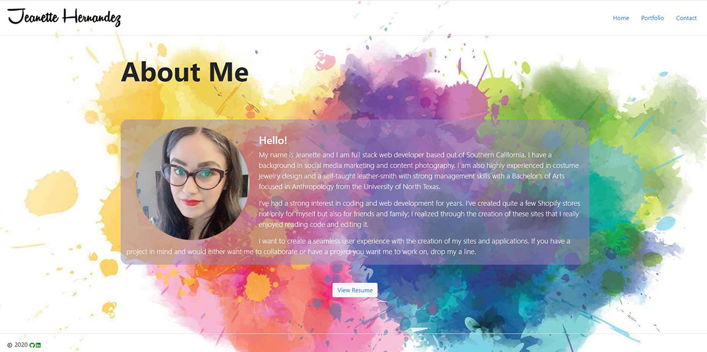
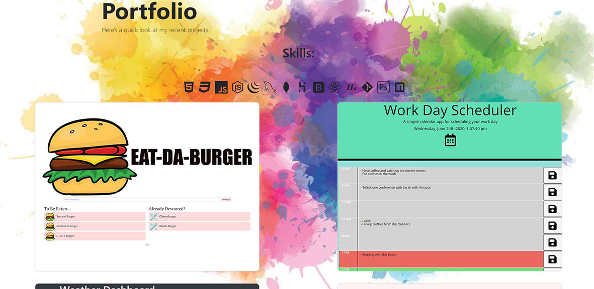
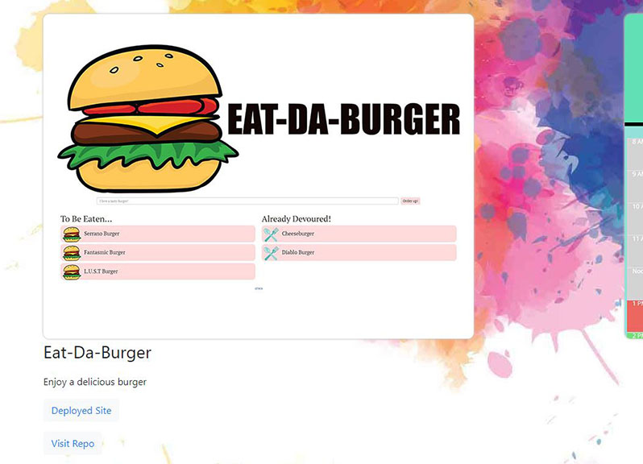
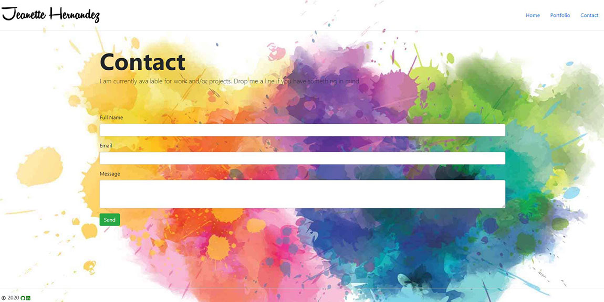

## Responsive Portfolio
---
## Description:

This updataed React portfolio features a working navbar that is also mobile responsive, along with a footer with LinkIn and GitHug icons that will take you to those sites. The portfolio page features some of my latest projects, click on the image to see the links to the deployed site and repo. 

With this portfolio update I created a working contact form and improved the overall design of the site.

<a href="https://jeanhern81.github.io/React_Portfolio/"> Click Here </a>to visit my portfolio!

---






---

## Code Snipet:

```
    handleChange = (event) => {
        const target = event.target;
        const value = target.type === 'checkbox' ? target.checked : target.value;
        const name = target.name;

        this.setState({
            [name]: value
        })
    }
    handleSubmit = (event) => {
        event.preventDefault();

        const templateParams = {
            name: this.state.name + " (" + this.state.email + ")",
            email: this.state.email,
            message: this.state.message
            };

        console.log(event.target);

        this.setState({
            disabled: false,
            emailSent: true
        });

```

---


## Techonologies Used:

This project was bootstrapped with [Create React App](https://github.com/facebook/create-react-app).

---

## Resources:

This video tutorial by Garrett Love helped me wrapped my head around the basic  I needed to get started with React.

<a href="https://www.youtube.com/playlist?list=PLnpdZyv-BjINbUjmTUsyziHz_4fa9hM5G"> React Portfolio Tutorial </a>. 
  
---
## MIT License:

Copyright (c) [2020] [Jeanette Hernandez]

Permission is hereby granted, free of charge, to any person obtaining a copy
of this software and associated documentation files (the "Software"), to deal
in the Software without restriction, including without limitation the rights
to use, copy, modify, merge, publish, distribute, sublicense, and/or sell
copies of the Software, and to permit persons to whom the Software is
furnished to do so, subject to the following conditions:

The above copyright notice and this permission notice shall be included in all
copies or substantial portions of the Software.

THE SOFTWARE IS PROVIDED "AS IS", WITHOUT WARRANTY OF ANY KIND, EXPRESS OR
IMPLIED, INCLUDING BUT NOT LIMITED TO THE WARRANTIES OF MERCHANTABILITY,
FITNESS FOR A PARTICULAR PURPOSE AND NONINFRINGEMENT. IN NO EVENT SHALL THE
AUTHORS OR COPYRIGHT HOLDERS BE LIABLE FOR ANY CLAIM, DAMAGES OR OTHER
LIABILITY, WHETHER IN AN ACTION OF CONTRACT, TORT OR OTHERWISE, ARISING FROM,
OUT OF OR IN CONNECTION WITH THE SOFTWARE OR THE USE OR OTHER DEALINGS IN THE
SOFTWARE.


